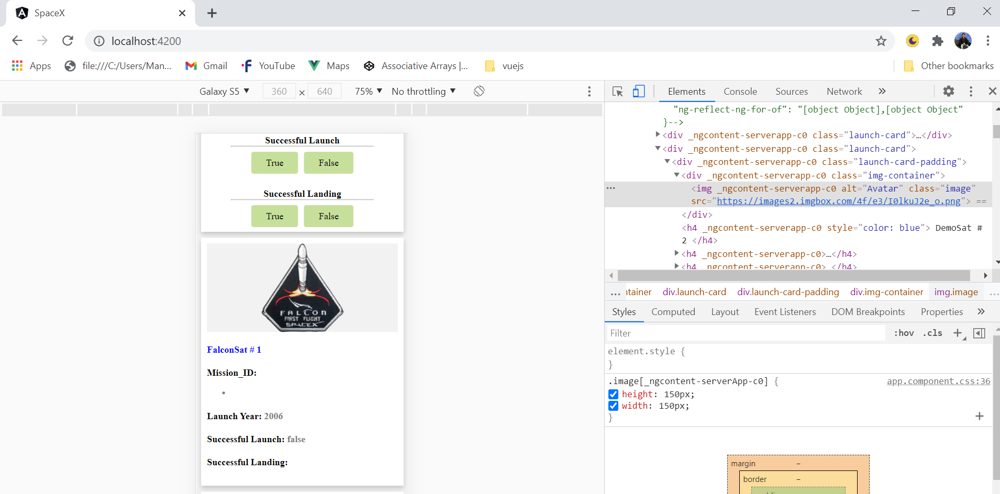

## About the project

This is a sample project which can be used to view launch program list of spacex. It uses spacex public API to pull its data.
It is designed to be a singe page application, for which following libraries are used:

* ``Angular8``
* ``Es6``
* ``NPM``
* ``Node``
* ``CSS3``
* ``Java Script``

## Highlights
- This is a progressive web application, which can be installed on any PWA compatible mobile device.
- Application is server-side rendered, which helps in boosting the initial page load time and increasing the SEO scores.
- Fully responsive to covers all range of device
- Uses lazy loading to defer loading off-screen images which results in reduced initial page load time
- Uses infinite scrolling approach to render the launch list in multiple steps, resulting in reduced dom elements on initial page load
- Used best practises and performation optimizations, resulting in a high lighthouse score

**Screen shot**

## Available Scripts

To run unit tests, you can use:
### `npm run test`

To run the project on local machine use following commands:
### `npm run start`

To build and run the project on local machine use following commands:
### `npm run build:ssr`
### `npm run serve:ssr`

